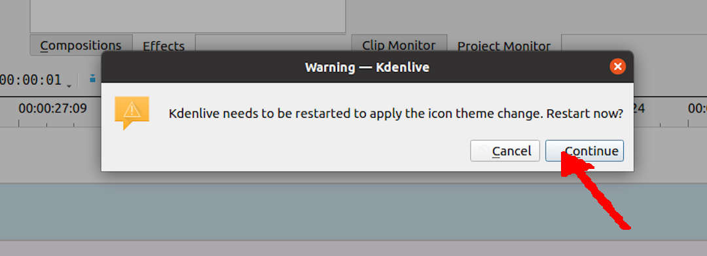
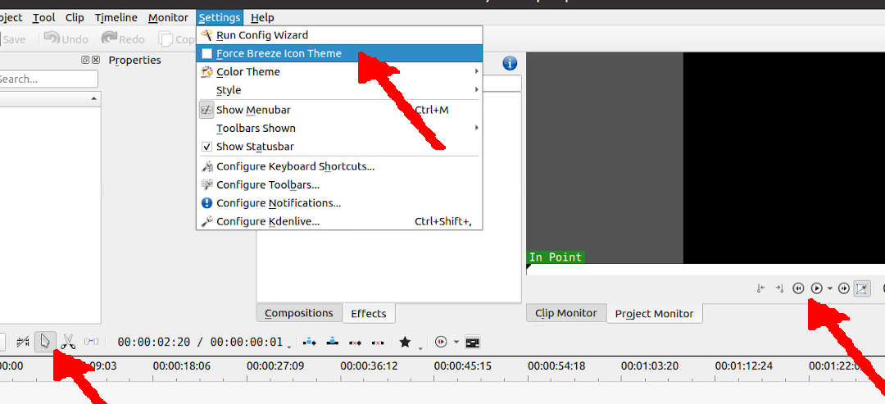
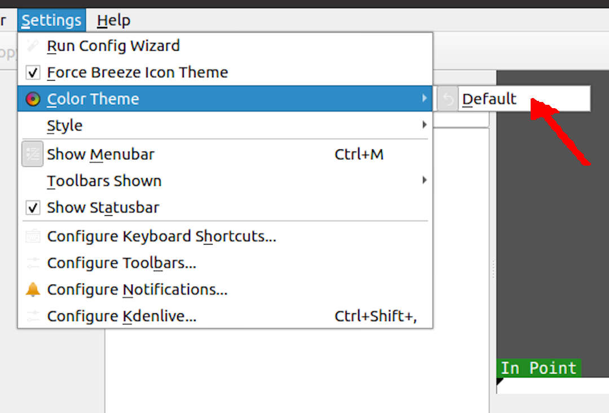
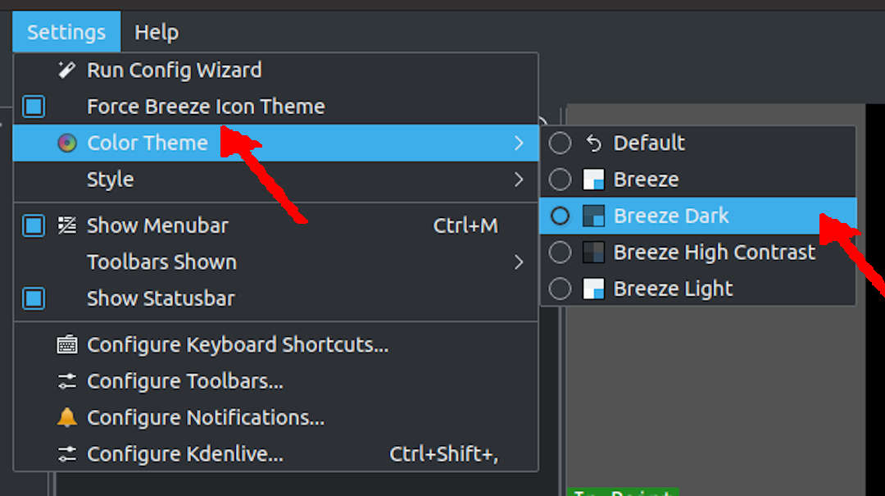

# KDENLIVE - UBUNTU - Icons Missing

There will be missing icons when installing 
the KDENLIVE package only on Ubuntu.
Ubuntu's KDENLIVE package assumes that you will 
install other KDE-related packages, including "breeze."
"Settings|Force Breeze Icon Theme" is turned on, by default.


Therefore, you should turn "Force Breeze Icon Theme" off and restart KDENLIVE.



Voila, the icons will re-appear!




<br id="idx01">
## Installing Breeze



However, since missing "Breeze" is the problem, why not install it?

```
sudo apt install breeze breeze-cursor-theme kde-style-breeze kwin-style-breeze -y

```

Now, you can choose "Color Theme" options like 
"Breeze," "Breeze Dark," "Breeze High Contrast," and "Breeze Light."



<br id="idx02">
# Nuclear Option

Just in case, you can "RESET KDENLIVE" by deleting the "kdenliverc" file.

```
$ ls -al $HOME/.config/kdenliverc 
-rw------- 1 cbkadal cbkadal 3706 May 30 12:41 /home/cbkadal/.config/kdenliverc
$ rm -f  $HOME/.config/kdenliverc 
$ 

```

This is the way!
