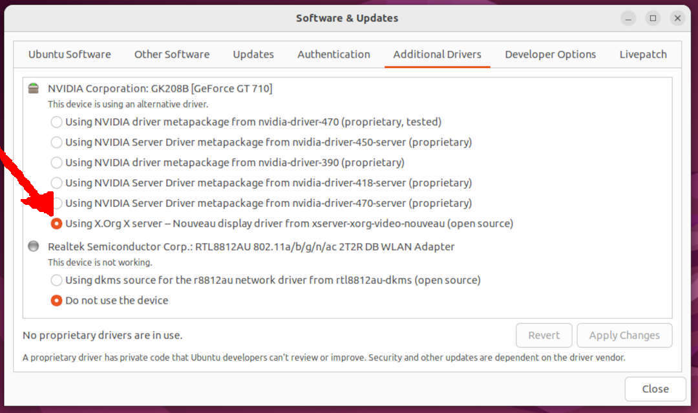

<br id="idx00">
# Ubuntu - Wayland - NVIDIA - Bazinga!

I don't know, but I was told:
Ubuntu Wayland should work!
Bazinga! 

My current Ubuntu 22.04 (as May 2022) with NVIDIA does not!
It used to work fine after installation but did not after the update/upgrade.
How to know if Wayland is active or not?
While asking for a password during the login process, 
there should be a setting option at the bottom of the right corner:
* Option #1: Ubuntu (on Wayland)
* Option #2: Ubuntu on Xorg

<br id="idx01">

<br><br id="idx02">

If the Wayland option does not appear, you should do the following.
First, disable the NVIDIA driver by selecting (clicking) 
"Application | Additional Drivers".

<br id="idx03">

<br><br id="idx04">

Then, select (click) "Using X.org X server" driver.

<br id="idx05">

<br><br id="idx06">

<br id="idx07">
## (Re) Enable Wayland

Edit (sudo) file "/etc/gdm3/custom.conf" to uncomment "WaylandEnable=true"

```
# File /etc/gdm3/custom.conf

[daemon]
# Uncomment the line below to force the login screen to use Xorg
WaylandEnable=true

```

<br id="idx08">
## Firefox

Firefox snap sucks (May 2022)! You should download it directly from:

<https://www.mozilla.org/en-US/firefox/linux/>.

