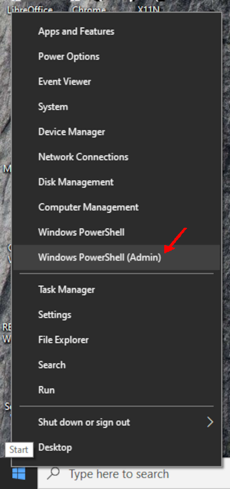
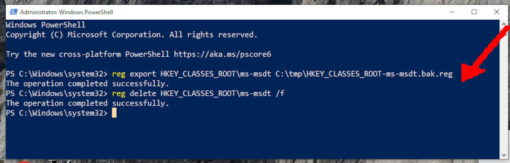

<br id="idx00">
# MSDT: CVE-2022-30190 Vulnerability (Follina)

## QUICK AND DIRTY PATCH

{{ page.description }}

This is a quick and dirty patch of MSDT: CVE-2022-30190
Microsoft Support Diagnostic Tool Vulnerability (Follina).
Assuming keeping your backup files in C:\tmp\.


<br id="idx01">
## Run Windows PowerShell (Admin)



<br id="idx02">
## BACKUP THEN DELETE REGISTRY "MS-MSDT"

```
reg export HKEY_CLASSES_ROOT\ms-msdt C:\tmp\HKEY_CLASSES_ROOT-ms-msdt.bak.reg

reg delete HKEY_CLASSES_ROOT\ms-msdt /f

```

<br id="idx02">


